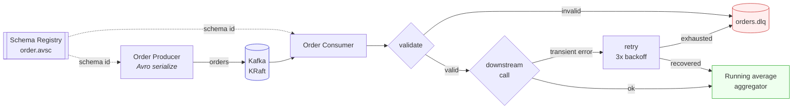

# kafka-avro-order-pipeline

A real-time order-processing pipeline built on **Apache Kafka** with **Avro** serialization,
featuring live price aggregation, bounded retry with exponential backoff, and a
**Dead Letter Queue** for messages that can never succeed.

> **EC8202 — Big Data Analytics**, Department of Electrical and Information Engineering,
> University of Ruhuna. Chapter 3 take-home assignment.

---

## What this does

A producer publishes `order` transactions to Kafka as Avro-encoded records. A consumer
decodes them against a registered schema, validates them, calls a (simulated) downstream
inventory service, and folds every accepted order into a **running average of prices** that
updates live on screen. Anything that fails is routed by *why* it failed:

- **Transient failure** (downstream unavailable) → retried with exponential backoff + jitter
- **Permanent failure** (invalid price, empty product, undecodable bytes) → **Dead Letter Queue**



---

## The message contract

`schemas/order.avsc` is the single source of truth, registered under the `orders-value`
subject in Schema Registry with **backward** compatibility enforced.

| Field | Avro type | Description |
|---|---|---|
| `orderId` | `string` | Unique identifier for the order, e.g. `"1001"` |
| `product` | `string` | Name of the purchased item, e.g. `"Item1"` |
| `price` | `float` | Price of the product (randomized) |

Avro is used in Confluent wire format: a magic byte, a 4-byte schema ID, then the binary
payload. The schema itself is never shipped with the message — only its ID — which is what
makes Avro dramatically more compact than JSON on a high-volume topic.

---

## Quick start

**Prerequisites:** Docker Desktop, Python 3.11+.

```powershell
# 1. Start Kafka (KRaft), Schema Registry and Kafka UI
docker compose up -d

# 2. Install Python dependencies
python -m venv .venv
.\.venv\Scripts\Activate.ps1
pip install -r requirements.txt

# 3. Create the topics
python scripts/create_topics.py

# 4. Run the consumer (terminal 1)
python -m src.consumer.main

# 5. Run the producer (terminal 2)
python -m src.producer.main
```

Kafka UI is at **http://localhost:8080** — use it to browse the `orders` and `orders.dlq`
topics live, and to view the registered Avro schema.

---

## Live demo script

This is the sequence to run during the demonstration. Roughly six minutes.

| # | Action | What to point at |
|---|---|---|
| 1 | `docker compose up -d` | Kafka, Schema Registry, Kafka UI coming up healthy |
| 2 | `python scripts/create_topics.py` | Three topics: `orders`, `orders.retry`, `orders.dlq` |
| 3 | Open http://localhost:8080 | Topics exist, both empty |
| 4 | Start consumer: `python -m src.consumer.main` | Dashboard renders, waiting at zero |
| 5 | Start producer: `python -m src.producer.main` | Running average moves on every message |
| 6 | Watch the consumer logs | Yellow `retrying in 0.4s` lines — **retry logic** |
| 7 | Watch the consumer logs | Red `DLQ <-` lines — **dead letter routing** |
| 8 | Kafka UI → `orders.dlq` → Messages | Headers carry the error type, offset, attempt count |
| 9 | `python scripts/inspect_dlq.py` | Table of every dead letter with its reason |
| 10 | Ctrl+C the consumer, restart it | Offsets resumed — **at-least-once, no data loss** |
| 11 | `pytest` | 27 tests green |

### Forcing each behaviour on demand

```powershell
# Only valid orders - shows the clean happy path
python -m src.producer.main --clean

# Heavy invalid traffic - fills the DLQ fast
python -m src.producer.main --permanent-fault-rate 0.5

# Force the downstream service to collapse - drives retries to exhaustion
python -m src.consumer.main --transient-fault-rate 0.9

# Downstream perfectly healthy - zero retries
python -m src.consumer.main --transient-fault-rate 0.0
```

`Item7` and `Item8` are hard-wired as "flaky" products in `src/processing/inventory.py`, so
retries appear reliably in a short demo instead of depending on luck.

---

## How the three required features work

### 1. Real-time aggregation — running average of prices

`src/processing/aggregator.py` uses **Welford's online algorithm** rather than keeping a
running sum and dividing. Both produce the same mean, but Welford stays numerically stable
over a long-lived stream and yields variance for free. Aggregation is maintained globally
and per product, and re-rendered on the dashboard after every message.

```
mean_n = mean_{n-1} + (x_n - mean_{n-1}) / n
```

### 2. Retry logic for temporary failures

`src/processing/retry.py` implements bounded exponential backoff:

```
delay(attempt) = min(base * 2^(attempt-1), max_delay) * uniform(0.5, 1.0)
```

Defaults: 3 attempts, 0.4 s base, 6 s ceiling. The jitter matters — without it, a fleet of
consumers that failed together would retry in lockstep and stampede an already-struggling
downstream service.

Crucially, `RetryPolicy.run()` retries **only** `TransientError`. A `PermanentError` is
re-raised immediately: retrying a negative price can never turn it positive, so burning the
retry budget on it just delays the inevitable and blocks the partition.

### 3. Dead Letter Queue

`src/consumer/dlq.py` publishes to `orders.dlq` with two deliberate design choices:

- **The original bytes are forwarded untouched.** If a message failed to deserialize,
  re-encoding it is impossible; and re-encoding one that *did* decode would hide the exact
  bytes that caused the problem.
- **Failure context travels as Kafka headers**, so a dead letter is self-describing and
  replayable without cross-referencing consumer logs:

| Header | Meaning |
|---|---|
| `x-original-topic` / `x-original-partition` / `x-original-offset` | Exactly where it came from |
| `x-error-type` | `PermanentError` or `RetriesExhausted` |
| `x-error-message` | Human-readable cause |
| `x-retry-attempts` | How hard we tried before giving up |
| `x-consumer-group` | Which consumer group gave up |
| `x-failed-at` | UTC timestamp |

---

## Delivery semantics

The pipeline is **at-least-once**.

- The producer runs with `acks=all` and `enable.idempotence=true`, so a broker-side retry
  cannot silently duplicate or reorder a record within a partition.
- The consumer disables auto-commit and commits synchronously **only after** a message
  reaches a terminal state — aggregated, or safely parked in the DLQ. A crash mid-processing
  therefore replays the message rather than losing it.
- The trade-off: a crash in the window between processing and commit means one order is
  counted twice in the average. Exactly-once would require Kafka transactions tying the
  offset commit and the aggregate update into one atomic write — worth it for financial
  totals, overkill for a monitoring average.
- Messages are keyed by `orderId`, so all records for one order land on the same partition
  and keep their relative order.

---

## Project layout

```
kafka-avro-order-pipeline/
├── docker-compose.yml          Kafka (KRaft) + Schema Registry + Kafka UI
├── schemas/order.avsc          The message contract
├── src/
│   ├── config.py               Environment-driven settings
│   ├── domain/order.py         Order record <-> Avro mapping
│   ├── common/
│   │   ├── errors.py           TransientError vs PermanentError
│   │   ├── headers.py          DLQ provenance headers
│   │   └── kafka_clients.py    Producer/consumer/serializer factories
│   ├── processing/
│   │   ├── validation.py       Business rules (permanent faults)
│   │   ├── inventory.py        Simulated downstream (transient faults)
│   │   ├── retry.py            Exponential backoff + jitter
│   │   └── aggregator.py       Running average (Welford)
│   ├── producer/main.py        Publishes Avro orders, injects bad data
│   └── consumer/
│       ├── main.py             Poll -> decode -> validate -> retry -> aggregate
│       ├── dlq.py              Dead letter publisher
│       ├── stats.py            Pipeline counters
│       └── dashboard.py        Live terminal dashboard
├── scripts/
│   ├── create_topics.py        Idempotent topic creation
│   └── inspect_dlq.py          Reads the DLQ and explains every failure
├── tests/                      27 unit tests
└── docs/                       Architecture notes and report material
```

---

## Configuration

Copy `.env.example` to `.env` to override any default.

| Variable | Default | Purpose |
|---|---|---|
| `KAFKA_BOOTSTRAP_SERVERS` | `localhost:9092` | Broker address |
| `SCHEMA_REGISTRY_URL` | `http://localhost:8081` | Schema Registry |
| `TOPIC_ORDERS` | `orders` | Main topic |
| `TOPIC_DLQ` | `orders.dlq` | Dead letter topic |
| `CONSUMER_GROUP` | `order-processor` | Consumer group id |
| `MAX_RETRY_ATTEMPTS` | `3` | Retry budget per message |
| `RETRY_BASE_DELAY_SECONDS` | `0.4` | Backoff base |
| `RETRY_MAX_DELAY_SECONDS` | `6.0` | Backoff ceiling |
| `FAULT_RATE_PERMANENT` | `0.08` | Share of deliberately invalid orders |
| `FAULT_RATE_TRANSIENT` | `0.15` | Simulated downstream failure rate |

---

## Tests

```powershell
pytest
```

Covers the aggregator (including numerical stability over 10,000 messages), the validation
rules, the retry policy's backoff curve and its refusal to retry permanent errors, and the
DLQ header contract.

---

## Scaling beyond one machine

The `orders` topic is created with 3 partitions, so up to three consumers in the
`order-processor` group can process in parallel with Kafka handling the rebalance. The
aggregator as written is per-process; making the running average correct across a
multi-consumer group would mean either a Kafka Streams state store or publishing partial
aggregates to a compacted topic and folding them downstream.

---

## Troubleshooting

| Symptom | Fix |
|---|---|
| `%3\|...\|FAIL\|...Connection refused` | Kafka isn't up yet: `docker compose ps`, wait for `healthy` |
| `Subject 'orders-value' not found` | Run the producer once — it registers the schema on first publish |
| Consumer sees nothing | Topics missing (`python scripts/create_topics.py`) or the group already consumed to the end |
| Reset everything | `docker compose down -v` then `docker compose up -d` |

---

## License

Coursework submission for EC8202. Not licensed for reuse.
